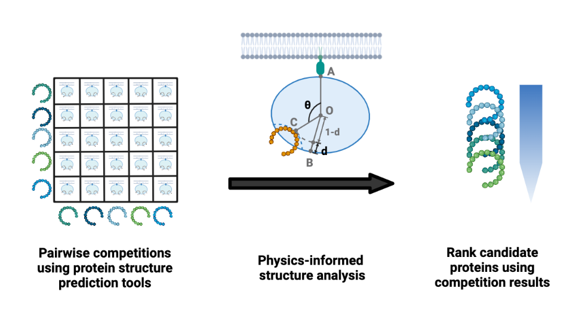

# APPRAISE: Rank binders by structure modeling

***A***utomated ***P***air-wise ***P***eptide-***R***eceptor binding model ***A***nalys***I***s for ***S***creening ***E***ngineered proteins (***APPRAISE***) is a method that predicts the receptor binding propensity of engineered proteins based on high-precision protein structure prediction tools, such as AlphaFold2-multimer. The APPRAISE Python package includes tools for preparing input files and analyzing the modeled structures.

Current APPRAISE supports backend-specific input generation for legacy ColabFold/AlphaFold-style FASTA files as well as newer open-source multimer tools including **Boltz-1**, **Chai-1**, and **OpenFold3**. On the output side, APPRAISE can now discover nested `.pdb`, `.cif`, and `.mmcif` structure files as long as the APPRAISE job name is preserved as the input file stem or enclosing folder name. Support beyond **AlphaFold2-multimer** and **ESMFold** should currently be treated as **BETA** only.



Author: Xiaozhe Ding (Email: dingxiaozhe@gmail.com, xding@caltech.edu; Twitter: [@DingXiaozhe](https://twitter.com/dingxiaozhe?lang=en))

## Getting started without installation

We recommend using APPRAISE remotely by running Colab-APPRAISE notebook on Google Colaboratory, which allows you to access APPRAISE with a **web-based interface**. This notebook guides users through the APPRAISE process step-by-step, with results stored on Google Drive. No need for a local installation when using this notebook.

The basic service of Google Colaboratory is free, although you can choose paid plans to get more stable access to better hardwares.

**How to run Colab-APPRAISE**
1. [Open Colab-APPRAISE notebook in Google Colaboratory](https://colab.research.google.com/github/xz-ding/APPRAISE/blob/main/Colab_APPRAISE.ipynb);
2. Go to "File --> save a copy in Drive" to save a copy of your own;
3. Follow the Quick guide on the top of the notebook, and you can start APPRAISing!

The notebook now supports these modeling paths:

- Step 2A: AlphaFold-multimer via ColabFold
- Step 2B: ESMFold
- Step 2C: Boltz-1
- Step 2D: Chai-1
- OpenFold3: prepare inputs in Step 1, run OpenFold3 externally, then return to Step 3 for quantification

At the moment, support beyond AlphaFold2-multimer and ESMFold is **BETA** only. Boltz-1, Chai-1, and OpenFold3 integration are available for early adopters, but they have not yet been validated as extensively as the legacy APPRAISE workflows.

Legacy compatibility is preserved:

- Step 2A still supports the AlphaFold2-multimer `v1`, `v2`, and `v3` model choices exposed in the notebook
- Step 2B still uses APPRAISE's legacy FASTA inputs, including optional glycine-linker single-chain inputs for ESMFold-style runs

## Local installation

### Environment

Historical reference environment from APPRAISE 1.2:

 - MacOS 10.14.6

 - Python 3.6.10

 - Alphafold-colabfold 2.1.14 (Available [here](https://github.com/sokrypton/ColabFold))

 - PyMOL 2.3.3 (Schrodinger LLC.)

 - Python packages (will be automatically handled by pip):

    - scipy 1.4.1

    - numpy 1.18.2

    - pandas 1.1.5

    - matplotlib 3.2.1

    - seaborn 0.11.2


### Installation options

Installation of APPRAISE locally requires pip. In most cases, pip comes with your Python environment. If not, you can [follow the instructions here to install pip](https://pip.pypa.io/en/stable/installation/).

#### Option 1 (recommended)
Install the distribution from PyPI. In the terminal, run:

```
pip install appraise
```

#### Option 2 (back-up)
Download the repository to your local computer and unzip. In the terminal, [change the working folder](https://ss64.com/osx/cd.html) to the directory containing the appraise package folder and setup.py, and run the following line:

```
pip install -e .
```

### Demo
You can find a few demo notebooks that work **locally** in the [demo folder on GitHub](https://github.com/GradinaruLab/APPRAISE/tree/main/demo).

## Preparing inputs for newer modeling backends

These newer backend integrations are currently **BETA**. We recommend manually checking a few representative structures and rankings before using them for a larger screening campaign.

`appraise.input_fasta_prep.get_complex_fastas(...)` now accepts a `modeling_backend` argument. APPRAISE keeps its own competition job name as the file stem and writes backend-specific input files:

- `modeling_backend='colabfold'`, `'alphafold2_multimer'`, `'alphafold2_multimer_v1'`, `'alphafold2_multimer_v2'`, `'alphafold2_multimer_v3'`, `'esmfold'`, or `'esmfold2'`: legacy colon-separated `.fasta`
- `modeling_backend='boltz1'`: one Boltz YAML file per APPRAISE job
- `modeling_backend='chai1'`: one multi-chain Chai FASTA file per APPRAISE job
- `modeling_backend='openfold3'`: one OpenFold3 query `.json` per APPRAISE job

Example:

```python
from appraise.input_fasta_prep import get_complex_fastas

get_complex_fastas(
    receptor_name="LY6A",
    receptor_seq="...",
    list_peptide1_names=["PHP.eB", "AAV9"],
    list_peptide1_seqs=["...", "..."],
    mode="pairwise",
    modeling_backend="boltz1",
    folder_path="./boltz_inputs/",
)
```

## Using newer modeling backends from Colab-APPRAISE

These Colab paths are currently **BETA** for Boltz-1, Chai-1, and OpenFold3. The legacy AlphaFold2-multimer and ESMFold notebook flows remain the best-validated APPRAISE paths at this moment.

In `Colab_APPRAISE.ipynb`, Step 1.4 exposes the same `modeling_backend` selector used by the Python API. Match the backend choice in Step 1 to the modeling block you plan to run next:

- `modeling_backend='colabfold'`: Step 2A or Step 2B
- `modeling_backend='boltz1'`: Step 2C, which consumes APPRAISE-generated Boltz YAML inputs and writes nested Boltz result folders
- `modeling_backend='chai1'`: Step 2D, which consumes APPRAISE-generated Chai FASTA inputs and writes one result folder per APPRAISE job
- `modeling_backend='openfold3'`: prepare APPRAISE JSON inputs in Step 1, run OpenFold3 outside the notebook, then return to Step 3 for quantification

Step 3 of the notebook can quantify flat or nested `.pdb`, `.cif`, and `.mmcif` outputs, so APPRAISE can score results from newer backends as long as the APPRAISE job name is preserved in the input file stem or enclosing result folder name.

## Using APPRAISE with external structure-modeling runs

External integration for Boltz-1, Chai-1, and OpenFold3 is currently **BETA** at the APPRAISE layer. Input/output compatibility is supported, but we still recommend manual sanity checks before relying on those workflows for production decisions.

When you run Boltz-1, Chai-1, or OpenFold3 outside APPRAISE, keep the APPRAISE job name as the input file stem. APPRAISE uses that stem to match structure outputs back to peptide competitions during quantification.

If you start from APPRAISE-generated Step 1 inputs, no additional renaming is usually required. If you export to another naming scheme, preserve the APPRAISE job name either in the structure file stem or in its parent result-folder name.

APPRAISE quantification now supports:

- flat or nested result folders
- legacy AlphaFold/ColabFold `_relaxed_*.pdb` and `_unrelaxed_*.pdb` outputs
- newer `.cif` and `.mmcif` outputs from tools such as Boltz-1, Chai-1, and OpenFold3

## References

[Manuscript](https://www.cell.com/molecular-therapy-family/molecular-therapy/fulltext/S1525-0016(24)00219-3)

Xiaozhe Ding\*, Xinhong Chen, Erin E. Sullivan, Timothy F Shay, Viviana Gradinaru\*. APPRAISE: Fast, accurate ranking of engineered proteins by receptor binding propensity using structural modeling. Molecular Therapy (2024). \* Corresponding authors.

[Manuscript-related data](https://data.caltech.edu/records/kxjgj-tfk18)

The dataset contains all structural models and sequences used in Ding et al., 2024.

[Github repository](https://github.com/xz-ding/APPRAISE)

The repository contains the latest version of APPRAISE package, Colab-APPRAISE notebook, and demo notebooks.

## Related resources

[ColabFold](https://github.com/sokrypton/ColabFold)

ColabFold provides a panel of user-friendly tools for structure modeling that are used by APPRAISE.
